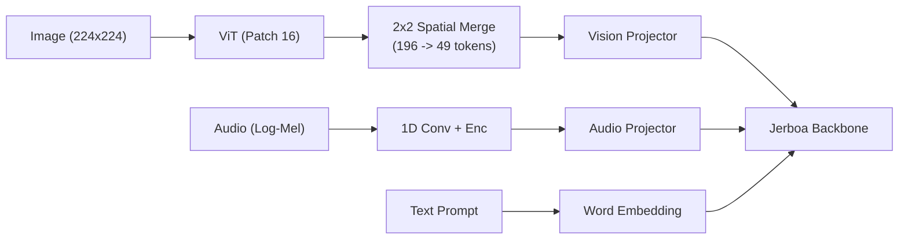

# Model Architecture & Design

JerboaLM is an ultra-lightweight language and multimodal model (~138M–146M parameters) designed for Apple Silicon (MPS / Metal) and edge deployments.

---

## 1. Specifications

| Parameter | Language Backbone (`JerboaForCausalLM`) | Multimodal (`JerboaVLForConditionalGeneration`) |
| :--- | :--- | :--- |
| **Total Parameters** | **~138.4M** (base) / **~145.9M** (with MTP) | **~145.2M** |
| **Hidden Size ($d_{model}$)** | 768 | 768 |
| **Intermediate Size ($d_{ffn}$)** | 2048 (SwiGLU) | 2048 |
| **Layers** | 16 | 16 |
| **Attention Heads** | 12 Query / 4 KV (GQA 3:1) | 12 Query / 4 KV |
| **Context Length** | 4,096 tokens (extensible to 16K via YaRN) | 4,096 tokens |
| **Vocabulary Size** | 49,164 tokens | 49,164 tokens |
| **VRAM Footprint** | **~500 MB** (FP32) / **~250 MB** (FP16) | **~600 MB** |

---

## 2. Core Architecture

### ① Normalization & Stability
- **Pre-RMSNorm**: Eliminates mean calculation overhead:
  $$\text{RMSNorm}(x) = \frac{x}{\sqrt{\frac{1}{d} \sum_{i=1}^d x_i^2 + \epsilon}} \odot \gamma$$
- **QK-Norm**: Normalizes Query and Key vectors per-head prior to dot-product attention, bounding logit scales and preventing training entropy collapse:
  $$Q' = \text{RMSNorm}(Q), \quad K' = \text{RMSNorm}(K)$$

### ② Attention Mechanism
- **Grouped-Query Attention (GQA 3:1)**: Shares 4 Key-Value heads across 12 Query heads, reducing KV cache memory by 66.7%.
- **MQA Support**: Supports single-KV head mode (`num_key_value_heads=1`) via configuration.
- **Hardware Acceleration**: Native PyTorch SDPA (`F.scaled_dot_product_attention`) using Metal kernels on macOS.

### ③ Feed-Forward Network & Weight Tying
- **SwiGLU Activation**:
  $$\text{SwiGLU}(x) = \left(\text{SiLU}(x W_{gate}) \otimes x W_{up}\right) W_{down}$$
- **Tied Word Embeddings**: $W_{lm\_head} = W_{embed}^T$. Saves ~25M parameters in the sub-200M regime, reallocating capacity into transformer depth.

---

## 3. Modern SLM Innovations

### ① Interleaved Sliding Window Attention (SWA)
- **Mechanism**: 12 layers restrict attention to a local 2,048-token window; every 4th layer (layers 4, 8, 12, 16) performs full global attention.
- **Benefit**: Cuts KV cache memory by **~60%** in long sequences (16K+) while preserving global context recall via periodic anchor layers.

### ② Multi-Token Prediction (MTP)
- **Mechanism**: Auxiliary 1-layer transformer block predicts token $t+2$ concurrently from hidden state $h_t$ and embedding $e(x_{t+1})$.
- **Loss**:
  $$\mathcal{L}_{total} = \mathcal{L}_{next} + 0.3 \cdot \mathcal{L}_{mtp}$$
- **Inference**: Enables 2-token simultaneous emission per forward step via speculative decoding (`generate_2token_step()`).

### ③ YaRN RoPE Scaling
- **Mechanism**: Scales Rotary Position Embeddings across frequencies:
  - High frequencies (local syntax): Preserved without scaling.
  - Low frequencies (global position): Interpolated smoothly across context multiplier $s$.
- Extends context window from 4,096 to 16,384 tokens with zero additional parameters.

### ④ Standardized Special Tokens
Fully registered tokens to prevent sub-word fragmentation:
- **Reasoning**: `<think>`, `</think>`, `<answer>`, `</answer>`
- **ChatML**: `<|im_start|>`, `<|im_end|>`
- **Tool Calling**: `<tool_call>`, `</tool_call>`, `<tool_response>`, `</tool_response>`
- **Multimodal**: `<|image|>`, `<|audio|>`
- **Formatting**: `<|quad_space|>` (Python 4-space indent)

---

## 4. Multimodal Extension (`JerboaVL`)

- **Vision**: ViT encoder with $2\times 2$ spatial pooling compressing 196 patches into **49 tokens**, minimizing multimodal prefill latency.
- **Audio**: 80-channel log-Mel spectrogram encoder with 1D convolution downsampling.
- **Alignment**: 2-layer MLP projectors align visual and acoustic feature representations into LLM token embedding space.
- **Modular Architecture**: Vision and Audio projectors can be trained, saved, and loaded independently as lightweight plug-in modules (`projector.pt` ~2–3MB).
