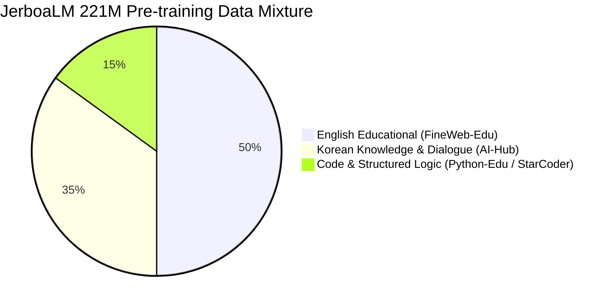
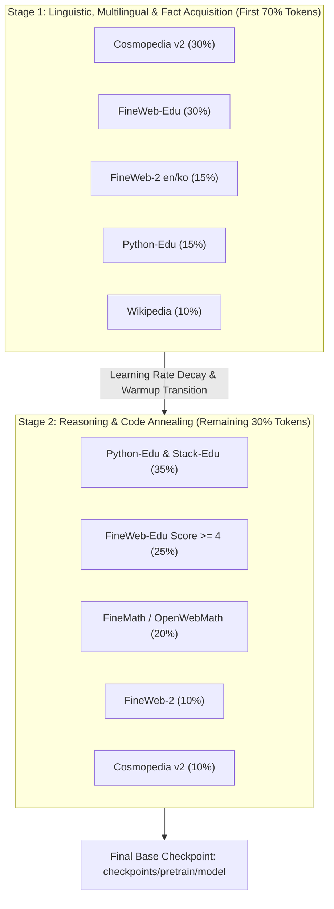

# JerboaLM Pre-training Data Strategy & Curriculum Plan

This document establishes the dataset portfolio, compute-scaling predictions, and curriculum strategy for pre-training **JerboaLM (~221.4M base / ~228.9M MTP)** with our custom 49,152 bilingual BPE tokenizer across local Apple Silicon (MPS) and cloud GPU environments.

---

## 1. Executive Summary & Design Principles

Unlike large foundation models (7B–70B+) that can brute-force learn patterns from raw web scrapes, **Sub-1B Small Language Models (SLMs)** require high information density. Noise, repetitive SEO spam, and grammatical degradation in uncurated web dumps quickly saturate small parameter capacities.

### Core Principles
1. **High-Signal Educational & Synthetic Dominance**:
   Following the empirical breakthroughs of *Textbooks Are All You Need (Phi-1/2)*, *Cosmopedia*, and *SmolLM*, over 60% of English content consists of synthetic textbooks, clean tutorials, and filtered educational web content (`FineWeb-Edu`, score $\ge 3$).
2. **Native Korean Knowledge & Dialogue Grounding**:
   Rather than translating English datasets or relying solely on noisy Korean web dumps, JerboaLM incorporates verified **AI-Hub corpora** (Knowledge 71894, Conversational 71908, Pre-training 71898) and colloquial instruction sets (`KoAlpaca`).
3. **Zero-Extract Archive Streaming & Chunk Alternation**:
   Data is ingested in cryptographically audited chunks (`SHA-256`) without uncompressing multi-hundred-gigabyte archives to disk. Languages are interleaved through clean **Round-Robin Chunk Alternation** (`FineWeb` $\leftrightarrow$ `AI-Hub`), eliminating catastrophic forgetting without over-engineered multi-threading.

---

## 2. Token Budget & Compute Scaling Predictions

JerboaLM configuration: `hidden_size=768, layers=28, heads=12, kv_heads=4, vocab=49152, tie_embeddings=True` $\rightarrow$ **~221.4M base active parameters**.

### Theoretical vs. Empirical Targets

| Metric | Token Budget | Tokens / Param | Expected Model Capability | Training Time (Est. on 2x RTX 5090 DDP) |
| :--- | :---: | :---: | :--- | :---: |
| **Phase 0: Smoke Test** | ~50M | ~0.23 | Convergence validation, loss drops from ~12.5 $\rightarrow$ ~6.0 | ~10 minutes |
| **Phase 1: Basic Fluency** | **1.0B – 2.0B** | 4.5 – 9.0 | Grammatical coherence, fluent bilingual generation, clean English/Korean | ~2.5 – 5.0 hours |
| **Phase 2: Core Competence** | **5.0B – 10.0B** | 22.5 – 45.0 | Solid world knowledge, simple reasoning, Python function completion, prime SFT base | ~12 – 24 hours |
| **Phase 3: Production SLM** | **30B – 50B** | 135 – 225 | Competitive with SmolLM-135M / Cosmo-1B benchmarks on MMLU/KoBEST | ~3 – 5 days |

---

## 3. Dataset Portfolio & Multilingual Mixture

The pre-training corpus balances English, Korean, and Code logic:



### Dataset Inventory

| Category | Dataset Name | Source Identifier | Target Proportion | Purpose & Signal Characteristic |
| :--- | :--- | :--- | :---: | :--- |
| **English Educational** | **FineWeb-Edu** | `HuggingFaceFW/fineweb-edu` (`sample-10BT`) | **50%** | Web text filtered by Llama-3-70B classifier for educational value (score $\ge 3$). High linguistic diversity. |
| **Korean Knowledge** | **AI-Hub 지식/지능** | AI-Hub `71894` (`annotation.json`) | **20%** | Formal Korean encyclopedic Q&A, scientific concepts, cultural background. |
| **Korean Dialogue** | **AI-Hub 대화생성형** | AI-Hub `71908` (`annotation_qa`) | **15%** | Natural conversational Korean, multi-turn dialogues, image captions. |
| **Code & Logic** | **Python-Edu & Stack-Edu** | `flytech/python-codes-25k` & `smollm-corpus` | **15%** | Educational Python scripts, docstrings, unit tests, algorithmic reasoning. |

### Latest Ecosystem Context & SOTA Model Provenance (SmolLM2 to SmolLM3)

The dataset portfolio is continuously aligned with the latest open-source small model frontier, progressing through three distinct evolutionary generations:

```
[Generation 1: 2022-2023]     [Generation 2: Late 2024 (SmolLM2)]     [Generation 3: Current (SmolLM3 Collection)]
Raw Common Crawl / C4    -->  FineWeb-Edu (Score >= 3)           -->  FineWeb-2 / FineWeb2-HQ + DCLM-1.0
The Pile / RefinedWeb    -->  DCLM (Apple/UW DataComp-LM)        -->  Curated Multi-Domain Web (11.2T mix)
Raw GitHub (Stack v1)    -->  Python-Edu & Stack-Edu             -->  Stack-Edu + Issues & Kaggle Notebooks
MathOverflow / GSM8K     -->  FineMath-4plus                     -->  FineMath + MegaMath + OpenMathReasoning
Hand-crafted Prompts     -->  Cosmopedia v2                      -->  StackExchange 2025 + Synthetic Reasoning
```

#### Key Upgrades in the SmolLM3 Ecosystem:
1. **SmolLM3 Architecture & Data Strategy**:
   - Hugging Face's flagship **SmolLM3 (SmolLM3-3B)** was trained on an unprecedented **11.2 Trillion tokens** using the public `smollm3-pretraining-datasets` collection.
   - It demonstrated that combining **FineWeb-Edu / FineWeb-2** with **DCLM** produces substantially higher general knowledge per token than relying on synthetic text alone.
2. **Next-Generation Reasoning Datasets**:
   - **`HuggingFaceTB/finemath`** & **`nvidia/OpenMathReasoning`**: Multi-step deductive reasoning and formula verification.
   - **`HuggingFaceTB/issues-kaggle-notebooks`**: Real-world exploratory data science and problem-solving logic.
3. **Application to JerboaLM (~138M)**:
   - While SmolLM3 targets 3B parameters with 11.2T tokens on compute clusters, JerboaLM distills the **exact same 3rd-generation dataset mixture** into a focused 1.0B–2.0B token budget.
   - This delivers state-of-the-art token efficiency on local Apple Silicon (MPS) without computing redundant or noisy web data.

---

## 4. Multi-Stage Curriculum Progression

Rather than feeding a flat mixture throughout the entire training run, JerboaLM employs a two-stage pre-training curriculum:



1. **Stage 1 (General Fluency, Multilingual Foundation & Fact Acquisition)**:
   - High volume of `Cosmopedia v2`, `FineWeb-Edu`, and `FineWeb-2` (including Korean `ko` subsets) establishes tokenizer coverage, morphological understanding, and foundational encyclopedic knowledge.
2. **Stage 2 (Reasoning & Code Annealing)**:
   - Shift ratio heavily toward `Python-Edu / Stack-Edu` (35%) and `FineMath` (20%) during the final 30% of tokens while decaying the learning rate. This sharpens symbolic reasoning and prepares the model for ChatML instruction tuning (SFT).

---

## 5. Execution Recipes & Commands

### Milestone 1: 1.0B Token Fluency Run (Local Mac / MPS)

In rolling buffer mode, 1 chunk consists of 1,000 documents ($\approx 1.5\text{M}$ tokens). 
To reach 1.0 Billion tokens: $\approx 670$ chunks.

```bash
# 1. Start or resume rolling-buffer pre-training with auto-resume & sleep guard
make pretrain RESUME=auto

# 2. Pre-train with live experiment tracking on Weights & Biases
python pipeline/pretrain.py \
  --chunks 670 \
  --docs_per_chunk 1000 \
  --steps_per_chunk 30 \
  --batch_size 4 \
  --grad_accum 4 \
  --seq_len 256 \
  --lr 4.0e-4 \
  --resume auto \
  --wandb \
  --wandb_project jerboa \
  --wandb_run "jerboa-138m-1b-run"
```

### Key Monitoring Metrics
- **Validation Loss Target**: Loss should steadily descend from $\sim 10.5 \rightarrow 3.2 - 2.8$.
- **Perplexity ($e^{\text{loss}}$)**: Target perplexity $< 18.0$ on educational validation subsets.
- **Throughput Stability**: Maintain $8,000 - 18,000$ tokens/sec on Apple Silicon M-series.
