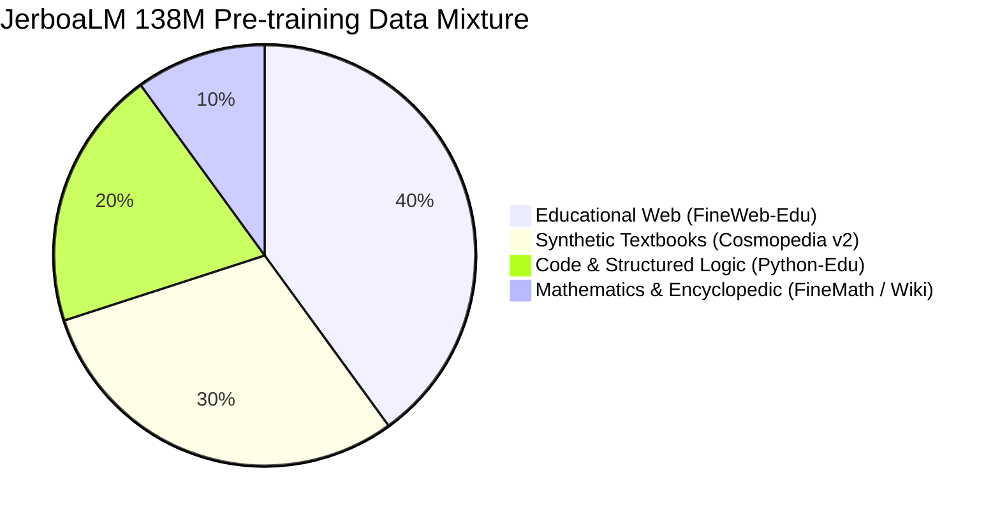
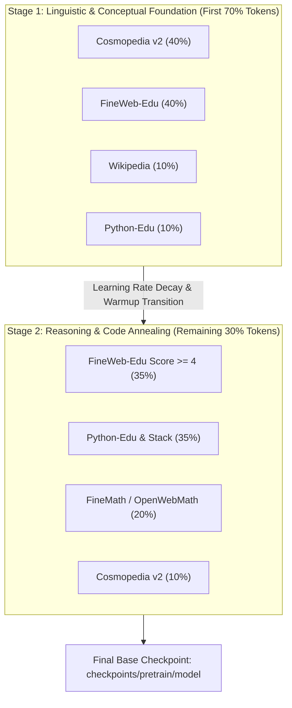

# JerboaLM Pre-training Data Strategy & Curriculum Plan

This document establishes the dataset portfolio, compute-scaling predictions, and curriculum strategy for pre-training **JerboaLM (~138M parameters)** on local Apple Silicon (MPS) and scalable compute environments.

---

## 1. Executive Summary & Design Principles

Unlike large foundation models (7B–70B+) that can brute-force learn patterns from raw web scrapes, **Sub-1B Small Language Models (SLMs)** require high information density. Noise, repetitive SEO spam, and grammatical degradation in uncurated web dumps quickly saturate small parameter capacities.

### Core Principles
1. **High-Signal Educational & Synthetic Dominance**:
   Following the empirical breakthroughs of *Textbooks Are All You Need (Phi-1/2)*, *Cosmopedia*, and *SmolLM*, over 70% of the corpus consists of synthetic textbooks, clean tutorials, and filtered educational web content.
2. **Code as a Reasoning Engine**:
   Code (especially Python) teaches structured syntax, variable tracking, and step-by-step logic, which directly boosts downstream chain-of-thought and general reasoning capabilities.
3. **Traceable Rolling Buffer**:
   Data is processed in cryptographically audited chunks (`SHA-256`), eliminating multi-hundred-gigabyte local disk requirements while maintaining strict lineage logs in `data/manifests/dataset_lineage.jsonl`.

---

## 2. Token Budget & Compute Scaling Predictions

JerboaLM configuration: `hidden_size=768, layers=16, heads=12, kv_heads=4, vocab=32768, tie_embeddings=True` $\rightarrow$ **~138M active parameters**.

### Theoretical vs. Empirical Targets

| Metric | Token Budget | Tokens / Param | Expected Model Capability | Apple Silicon Training Time (Est. @ 10k tok/s) |
| :--- | :---: | :---: | :--- | :---: |
| **Phase 0: Smoke Test** | ~50M | ~0.36 | Convergence validation, loss drops from ~10.5 $\rightarrow$ ~5.0 | ~1.4 hours |
| **Phase 1: Basic Fluency** | **1.0B – 2.0B** | 7.2 – 14.5 | Grammatical coherence, basic sentence completion, clean English generation | ~28 – 55 hours (~1.5–2.5 days) |
| **Phase 2: Core Competence** | **5.0B – 10.0B** | 36 – 72 | Solid world knowledge, simple reasoning, Python function completion, prime SFT base | ~6 – 12 days |
| **Phase 3: Production SLM** | **30B – 50B** | 215 – 360 | Competitive with SmolLM-135M / Cosmo-1B benchmarks on MMLU/GSM8k/HumanEval | Cloud / Distributed cluster |

> [!NOTE]
> **Chinchilla Optimal for 138M** is $20 \times 138\text{M} \approx 2.76\text{B}$ tokens.
> For SLMs, **overtraining** (up to 30B–50B tokens) is standard industry practice because runtime inference cost is identical while model intelligence continues to scale linearly.
> **Recommended initial milestone**: **Phase 1 (1.0B ~ 2.0B tokens)** to establish a reliable base model for downstream SFT and RL alignment without burning excessive hardware cycles.

---

## 3. Dataset Portfolio & Specification

The pre-training corpus is structured into four complementary pillars:



### Dataset Inventory

| Category | Dataset Name | Source Identifier | Target Proportion | Purpose & Signal Characteristic |
| :--- | :--- | :--- | :---: | :--- |
| **Educational Web** | **FineWeb-Edu** | `HuggingFaceFW/fineweb-edu` (`sample-10BT`) | **40%** | Web text filtered by Llama-3-70B classifier for educational value (score $\ge 3$). High linguistic diversity with filtered toxicity. |
| **Synthetic Textbooks** | **Cosmopedia v2** | `HuggingFaceTB/cosmopedia-v2` | **30%** | Synthetic textbooks, courses, and stories generated by Mixtral-8x7B. Dense explanation-to-token ratio; zero web fluff. |
| **Code & Logic** | **Python-Edu & The Stack Smol** | `HuggingFaceTB/smollm-corpus` (`python-edu`) | **20%** | Educational Python scripts, docstrings, unit tests, and algorithmic solutions. Trains causal dependencies and logic. |
| **STEM & Knowledge** | **FineMath + Wikipedia** | `HuggingFaceFW/finemath` + `wikimedia/wikipedia` | **10%** | Multi-step mathematical deductions, LaTeX expressions, and encyclopedic factual grounding. |

### Latest Ecosystem Context & SOTA Model Provenance (SmolLM2 to SmolLM3)

The dataset portfolio is continuously aligned with the latest open-source small model frontier, progressing through three distinct evolutionary generations:

```
[Generation 1: 2022-2023]     [Generation 2: Late 2024 (SmolLM2)]     [Generation 3: Current (SmolLM3 Collection)]
Raw Common Crawl / C4    -->  FineWeb-Edu (Score >= 3)           -->  FineWeb-2 / FineWeb2-HQ + DCLM-1.0
The Pile / RefinedWeb    -->  DCLM (Apple/UW DataComp-LM)        -->  Curated Multi-Domain Web (11.2T mix)
Raw GitHub (Stack v1)    -->  Python-Edu & Stack-Edu             -->  Stack-Edu + Issues & Kaggle Notebooks
MathOverflow / GSM8K     -->  FineMath-4plus                     -->  FineMath + MegaMath + OpenMathReasoning
Hand-crafted Prompts     -->  Cosmopedia v2                      -->  StackExchange 2025 + Synthetic Reasoning
```

#### Key Upgrades in the SmolLM3 Ecosystem:
1. **SmolLM3 Architecture & Data Strategy**:
   - Hugging Face's flagship **SmolLM3 (SmolLM3-3B)** was trained on an unprecedented **11.2 Trillion tokens** using the public `smollm3-pretraining-datasets` collection.
   - It demonstrated that combining **FineWeb-Edu / FineWeb-2** with **DCLM** produces substantially higher general knowledge per token than relying on synthetic text alone.
2. **Next-Generation Reasoning Datasets**:
   - **`HuggingFaceTB/finemath`** & **`nvidia/OpenMathReasoning`**: Multi-step deductive reasoning and formula verification.
   - **`HuggingFaceTB/issues-kaggle-notebooks`**: Real-world exploratory data science and problem-solving logic.
3. **Application to JerboaLM (~138M)**:
   - While SmolLM3 targets 3B parameters with 11.2T tokens on compute clusters, JerboaLM distills the **exact same 3rd-generation dataset mixture** into a focused 1.0B–2.0B token budget.
   - This delivers state-of-the-art token efficiency on local Apple Silicon (MPS) without computing redundant or noisy web data.

---

## 4. Multi-Stage Curriculum Progression

Rather than feeding a flat mixture throughout the entire training run, JerboaLM employs a two-stage pre-training curriculum:



1. **Stage 1 (General Fluency & Fact Acquisition)**:
   - High volume of `Cosmopedia v2` and `FineWeb-Edu` establishes tokenizer coverage, English morphology, vocabulary usage, and foundational encyclopedic knowledge.
2. **Stage 2 (Reasoning & Code Annealing)**:
   - Shift ratio heavily toward `Python-Edu` (35%) and `FineMath` (20%) during the final 30% of tokens while decaying the learning rate. This sharpens symbolic reasoning and prepares the model for ChatML instruction tuning (SFT).

---

## 5. Execution Recipes & Commands

### Milestone 1: 1.0B Token Fluency Run (Local Mac / MPS)

In rolling buffer mode, 1 chunk consists of 1,000 documents ($\approx 1.5\text{M}$ tokens). 
To reach 1.0 Billion tokens: $\approx 670$ chunks.

```bash
# 1. Start or resume rolling-buffer pre-training with auto-resume & sleep guard
make pretrain RESUME=auto

# 2. Pre-train with live experiment tracking on Weights & Biases
python pipeline/pretrain.py \
  --chunks 670 \
  --docs_per_chunk 1000 \
  --steps_per_chunk 30 \
  --batch_size 4 \
  --grad_accum 4 \
  --seq_len 256 \
  --lr 4.0e-4 \
  --resume auto \
  --wandb \
  --wandb_project jerboa \
  --wandb_run "jerboa-138m-1b-run"
```

### Key Monitoring Metrics
- **Validation Loss Target**: Loss should steadily descend from $\sim 10.5 \rightarrow 3.2 - 2.8$.
- **Perplexity ($e^{\text{loss}}$)**: Target perplexity $< 18.0$ on educational validation subsets.
- **Throughput Stability**: Maintain $8,000 - 18,000$ tokens/sec on Apple Silicon M-series.
