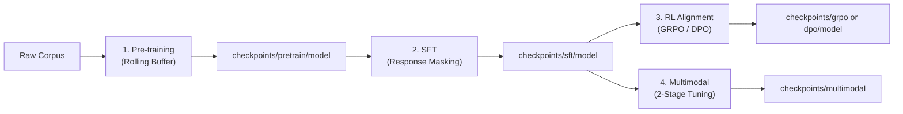

# Training & Data Lifecycle

JerboaLM follows a strict 1:1 symmetric architecture between dataset partitions (`data/`) and model weight checkpoints (`checkpoints/`).

---

## 1. Data & Checkpoint Mapping

```
jerboa/
├── data/                             # Dataset storage by stage
│   ├── pretrain/                     # Raw text (FineWeb-Edu, TinyStories)
│   ├── sft/                          # ChatML dialogues (sample.json)
│   ├── dpo/                          # Pairwise preferences (sample.json)
│   ├── grpo/                         # Verifiable reasoning problems (sample.json)
│   ├── multimodal/                   # Granular multimodal partitions
│   │   ├── image/                    # Image VQA & captioning (sample.json)
│   │   ├── audio/                    # Speech & sound understanding (sample.json)
│   │   ├── video/                    # Multi-frame video reasoning (sample.json)
│   │   └── interleaved/              # Joint Vision + Audio pairs (sample.json)
│   └── manifests/                    # SHA-256 lineage & training loss logs
│
└── checkpoints/                      # Model weights by stage
    ├── pretrain/model/               # Base weights & tokenizer
    ├── sft/model/                    # Supervised fine-tuned weights
    ├── dpo/model/                    # Direct preference aligned weights
    ├── grpo/model/                   # Reasoning aligned weights
    └── multimodal/                   # Modular & unified checkpoints
        ├── vision/projector.pt       # Vision-only projector (~3MB)
        ├── audio/projector.pt        # Audio-only projector (~2MB)
        └── unified/                  # stage_1.pt & stage_2.pt
```

### Schema Formats

| Stage | Path | Schema Structure |
| :--- | :--- | :--- |
| **SFT** | `data/sft/sample.json` | `{"messages": [{"role": "system\|user\|assistant", "content": "..."}]}` |
| **DPO** | `data/dpo/sample.json` | `{"prompt": "...", "chosen": "...", "rejected": "..."}` |
| **GRPO** | `data/grpo/sample.json` | `{"prompt": "...<think>...</think><answer>X</answer>", "expected_answer": "...", "domain": "math"}` |
| **MM: Image** | `data/multimodal/image/sample.json` | `{"id": "...", "image": "path.jpg", "conversations": [{"from": "human", "value": "<|image|>\n..."}, ...]}` |
| **MM: Audio** | `data/multimodal/audio/sample.json` | `{"id": "...", "audio": "path.wav", "conversations": [{"from": "human", "value": "<|audio|>\n..."}, ...]}` |
| **MM: Video** | `data/multimodal/video/sample.json` | `{"id": "...", "video": "path.mp4", "num_frames": 8, "conversations": [...]}` |
| **MM: Interleaved** | `data/multimodal/interleaved/sample.json` | `{"id": "...", "image": "path.jpg", "audio": "path.wav", "conversations": [...]}` |

---

## 2. Data Preparation

Stream open-source datasets and format them into target schemas:

```bash
# Pre-training: FineWeb-Edu educational subset (score >= 3)
python scripts/data/prepare.py --stage pretrain --source fineweb-edu --samples 1000

# SFT: Multi-turn instruction dialogues (UltraChat)
python scripts/data/prepare.py --stage sft --samples 200

# DPO: Human pairwise preferences (UltraFeedback)
python scripts/data/prepare.py --stage dpo --samples 200

# GRPO: Verifiable math reasoning (GSM8K)
python scripts/data/prepare.py --stage grpo --samples 200

# Prepare all baseline datasets at once
python scripts/data/prepare.py --stage all
```

---

## 3. Training Pipelines & Recipes

All training pipelines support **YAML recipes** (`recipes/*.yaml`) so hyperparameters can be maintained in configuration files rather than typed as long CLI flags:

| Shortcut | Pipeline | Default Recipe |
| :--- | :--- | :--- |
| `make pretrain` | Rolling-buffer pre-training | [`recipes/pretrain.yaml`](file:///Users/jc/jerboa/recipes/pretrain.yaml) |
| `make sft` | Supervised fine-tuning (ChatML) | [`recipes/sft.yaml`](file:///Users/jc/jerboa/recipes/sft.yaml) |
| `make dpo` | Direct preference optimization | [`recipes/dpo.yaml`](file:///Users/jc/jerboa/recipes/dpo.yaml) |
| `make grpo` | Group relative policy optimization | [`recipes/grpo.yaml`](file:///Users/jc/jerboa/recipes/grpo.yaml) |
| `make multimodal` | Multimodal projector warmup & tuning | [`recipes/multimodal.yaml`](file:///Users/jc/jerboa/recipes/multimodal.yaml) |
| `make bench` | MPS throughput benchmark | - |
| `make chat` | Interactive text chat REPL | - |

You can also specify a custom recipe or override specific parameters on the CLI:
```bash
python pipeline/sft.py --recipe custom_recipe.yaml
python pipeline/sft.py --epochs 5  # overrides recipe epochs
```



### ① Pre-training (`pipeline/pretrain.py`)
- **Rolling-Buffer Mode**: Streams chunks (e.g., 500 docs), calculates SHA-256 hashes, logs token counts, trains on MPS, and removes raw text to maintain near-zero disk overhead.
- **In-Memory / File Modes**: `--mode stream` (0 MB disk) or `--text_file <path>`.

```bash
# Default rolling buffer pre-training
python pipeline/pretrain.py --chunks 5 --docs_per_chunk 500 --steps_per_chunk 15

# Pre-train with live W&B tracking
python pipeline/pretrain.py --chunks 5 --wandb --wandb_run "exp-pretrain"

# Resume from latest checkpoint
python pipeline/pretrain.py --resume auto --chunks 5

# View training lineage ledger & loss curves locally
python scripts/tools/history.py
```

### ② Supervised Fine-Tuning (`pipeline/sft.py`)
- Computes loss **strictly on assistant responses** (`labels = -100` for system and user tokens) using ChatML formatting.
- Supports optional W&B tracking via `--wandb`.

```bash
# SFT on local checkpoint or Hugging Face base
python pipeline/sft.py --model checkpoints/pretrain/model --data data/sft/sample.json --epochs 3 --wandb
```

### ③ Direct Preference Optimization (`pipeline/rl_dpo.py`)
- Implicit policy optimization with frozen reference model ($\pi_{ref}$):
  $$\mathcal{L}_{DPO}(\pi_\theta; \pi_{ref}) = -\mathbb{E}\left[\log \sigma\left(\beta \log \frac{\pi_\theta(y_w|x)}{\pi_{ref}(y_w|x)} - \beta \log \frac{\pi_\theta(y_l|x)}{\pi_{ref}(y_l|x)}\right)\right]$$
- Supports both text DPO and **Multimodal DPO** (anti-hallucination alignment via `--multimodal`).

```bash
# Text DPO
python pipeline/rl_dpo.py --model checkpoints/sft/model --data data/dpo/sample.json --steps 30 --beta 0.1

# Multimodal DPO (anti-hallucination)
python pipeline/rl_dpo.py --multimodal --steps 30 --beta 0.1
```

### ④ Group Relative Policy Optimization (`pipeline/rl_grpo.py`)
- DeepSeek-R1 style online reasoning alignment. Samples $G$ candidate outputs per prompt, scores via programmatic rule-based rewards, and computes group relative advantages without a Critic model.
- Supports both text reasoning and **Multimodal GRPO** (visual reasoning on geometry, charts, figures via `--multimodal`).

```bash
# Text GRPO reasoning
python pipeline/rl_grpo.py --model checkpoints/sft/model --data data/grpo/sample.json --steps 20 --group_size 4

# Multimodal GRPO visual reasoning
python pipeline/rl_grpo.py --multimodal --steps 20 --group_size 4
```

### ⑤ Multimodal Alignment (`pipeline/train_multimodal.py`)
- **Stage 1 (Projector Warmup)**: LLM and vision encoder frozen; trains vision & audio projectors.
- **Stage 2 (Full Fine-tuning)**: End-to-end tuning of projectors and language backbone.
- **Modular Training**: Train vision or audio projectors independently to save compute and enable modular serving.

```bash
# Modular: Train Vision Projector only (~3MB module)
python pipeline/train_multimodal.py --modality vision --epochs 2

# Modular: Train Audio Projector only (~2MB module)
python pipeline/train_multimodal.py --modality audio --epochs 2

# Unified: Stage 1 Projector warmup & Stage 2 Full tuning
python pipeline/train_multimodal.py --stage 1 --epochs 2
python pipeline/train_multimodal.py --stage 2 --epochs 2

# Custom dataset training
python pipeline/train_multimodal.py --data path/to/dataset.json --modality vision
```

---

## 4. Fault Tolerance & Long-Running Training Guide

JerboaLM is engineered with built-in fault tolerance designed for uninterrupted long-running training and graceful interruptions on Apple Silicon (MPS):

### ① Intentional Pause & Resume (Best Practice)
When you need to pause training to free up RAM/VRAM, shut down the computer, or perform other compute-heavy tasks:
- **Graceful Pause**: Press `Ctrl + C` in the training terminal.
  - The signal handler intercepts `SIGINT`, finishes the current step, and atomically flushes model weights, optimizer momentum, and LR scheduler state to an emergency checkpoint (`interrupted_step_XXXX`).
  - Unified memory / VRAM is 100% reclaimed upon clean exit.
- **Seamless Resume**:
  - Run with `--resume auto` or `make sft RESUME=auto` (or `make pretrain RESUME=auto`).
  - The pipeline automatically detects the latest checkpoint and resumes exact epoch, step, and optimizer momentum without loss spikes.

### ② Periodic Step Checkpointing & Rotation
- Intermediate checkpoints are automatically stored every $N$ steps (`save_steps`, default: 25-50).
- Checkpoint rotation (`save_total_limit`, default: 3) retains the most recent $K$ intermediate steps, preventing local disk overflow.
- Checkpoints contain:
  - Hugging Face / SafeTensors model weights & tokenizer
  - `training_state.pt`: `optimizer_state`, `scheduler_state`, `rng_state` (PyTorch & Python seed), and step offsets
  - `training_state.json`: Human-readable audit log

### ③ Built-in macOS Sleep Guard (`caffeinate`)
- `pipeline/checkpoint_manager.py` includes a native `SleepGuard` that activates macOS `caffeinate` bound to the training process PID.
- It prevents display and system idle sleep on Apple Silicon while training is active, eliminating MPS device disconnect crashes (`MPS backend error`).
- Once training completes or is gracefully paused, sleep assertions are immediately released.

```bash
# SFT with auto-resume enabled (via Makefile)
make sft RESUME=auto

# Pre-training with custom checkpoint retention
python pipeline/pretrain.py --resume auto --chunks 5

# Overnight training with screen power-off (cool lid open):
(sleep 2 && pmset displaysleepnow) & make sft RESUME=auto
```
